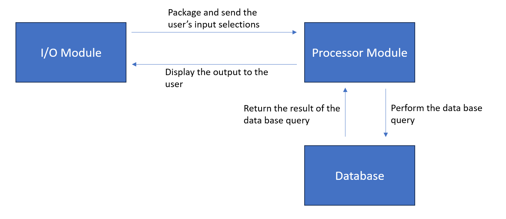

# Components

Name: I/O module (aka user interface?)\
What it does:\
The user interacts with this I/O module to query our system and view results.\
The user inputs their preferences (cost, location, quality, etc) and this module sends the packaged data to our Processor module.\
After receiving the output from the Processor module, the I/O module displays the output to the user. (see below for more details)\
		
Name: Input submodule\
What it does:\
Opens a web page with menus for user to input their preferences\
Takes user input from menus\
Sends result to processor module\
Inputs: None\
Outputs: Forwards the selections to the processor module.\

Name: Output submodule\
What it does:\
Takes the list from the processor module\
Displays a list the first 5 results\
Shows a map of the locations of the results\
Has buttons allowing the user to click on a resort name and get more info about the resort (querying the database module)\
Inputs: List of results received from the processor module for the given query.\
Outputs: Ski resort list and map\
Assumptions: The output from the processor module is valid\

Name: Processor module\
What it does:\
Takes the inputs provided by the I/O module\
Queries the database\
Calculates a score for each resort that is acceptable given the user inputs\
Creates a sorted list of the resorts in descending order of the score\
Send list to output module\
Inputs: List of selections from the user.\
Outputs: List of results from the database.\
Assumptions: The data in the database is valid\

Name: Database module\
What it does:\
Stores all resort information\
Queryable\
Aggregates the various data sources\
Submodule for each dataset to perform joint queries (no reason to fully join one dataframe initially)\
SQL Relational database?\
Assumptions: valid data sources loaded properly\
Inputs: List of user selections for each feature.\
Outputs: List of top matches for the query.\
Assumptions: The data is cleaned and valid.\

